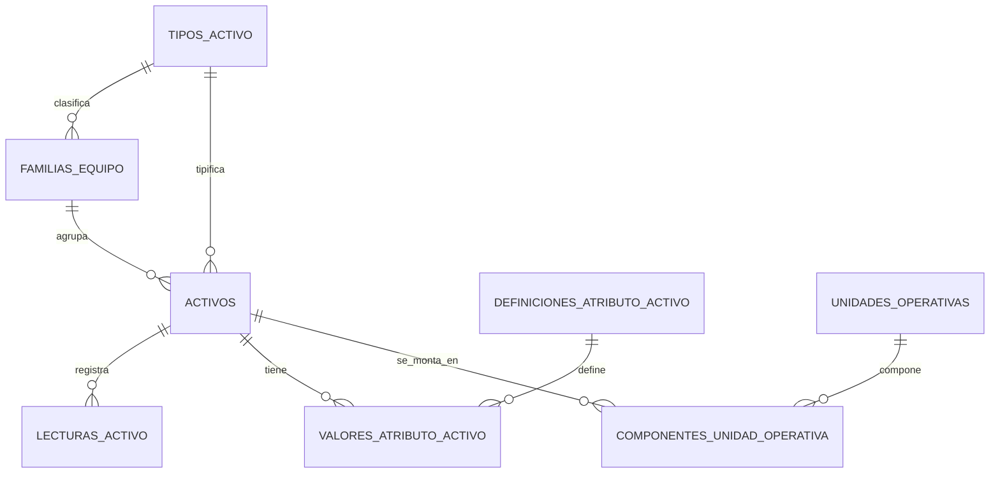

# Activos y fichas tecnicas

## Alcance

El modulo de activos implementa CRUD operativo, ficha tecnica, estados, eventos de estado, historial, documentos, costos preparados y disponibilidad.

## Backend

Endpoints expuestos:

- `GET /api/assets`
- `GET /api/assets/{id}`
- `POST /api/assets`
- `PUT /api/assets/{id}`
- `POST /api/assets/{id}/state-events`
- `GET /api/assets/{id}/history`
- `GET /api/assets/{id}/documents`
- `GET /api/assets/{id}/costs`
- `GET /api/assets/{id}/availability`

La logica vive en `IAssetService` y consume `IDataProvider`; para migrar a SQL se mantiene el contrato de aplicacion y se reemplaza la implementacion del provider.

## Excel inicial

`activos.xlsx` mantiene el maestro operativo. El codigo de activo es la llave natural y no se edita en `PUT`; si la ficha esta validada, el codigo queda tratado como dato bloqueado y cualquier correccion debe realizarse con trazabilidad.

Columnas nuevas agregadas al schema:

- `Familia`
- `Marca`
- `Modelo`
- `Patente`
- `Propiedad`
- `Criticidad`
- `EstadoDocumental`
- `EstadoOperacional`
- `CompletitudFicha`
- `FichaValidada`
- `FichaTecnicaJson`
- `FechaAlta`
- `FechaActualizacion`

`asset_state_events.xlsx` registra eventos de estado con usuario, motivo, estado anterior y estado nuevo.

## Reglas

- `Codigo` es unico y se valida sin distinguir mayusculas/minusculas.
- El cambio de faena requiere permiso `activos.cambiar_faena`.
- Los usuarios sin administracion solo ven activos de sus faenas autorizadas.
- Un documento critico vencido deja al activo no disponible documentalmente.
- La completitud de ficha se calcula con campos obligatorios de identificacion, familia, marca, modelo, serie, propiedad, criticidad y estados.
- Costos se exponen solo a usuarios con permiso `costos.ver`; el contrato queda preparado para el modulo de costos posterior.

## Frontend

La ruta `/activos` reemplaza el placeholder y muestra:

- Listado filtrable por faena, estado, familia y criticidad.
- Formulario de creacion/edicion.
- Ficha 360 con tabs: General, ficha tecnica, documentos, repuestos, OT, costos, disponibilidad e historial.
- Indicador visual de ficha completa, parcial o pendiente.

## Modelo de activos normalizado

Los activos representan elementos físicos individuales. `tipos_activo` y `familias_equipo` se resuelven por FK; una familia pertenece a un tipo. La composición funcional se representa con `unidades_operativas` y el historial temporal de `componentes_unidad_operativa`, nunca como un tercer activo ni como nodo técnico.

Los datos variables se almacenan tipadamente en `definiciones_atributo_activo` y `valores_atributo_activo`. La medición de uso es única (`HOROMETRO`, `KILOMETRAJE` o nula) y las lecturas inmutables se registran en `lecturas_activo`. Los requisitos documentales se configuran por tipo/familia en `requisitos_documentales_tipo_activo`; el estado documental y la disponibilidad se calculan.

