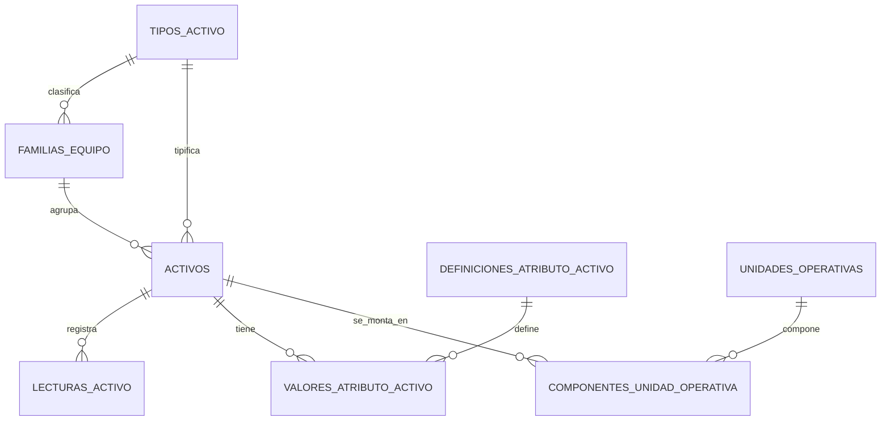

# Disponibilidad contractual

## Alcance

El modulo calcula disponibilidad por faena, contrato y cliente usando dos miradas:

- Cantidad: equipos cubiertos versus equipos comprometidos.
- Horas: horas disponibles versus horas comprometidas en el periodo.

La pagina operativa esta en `/disponibilidad` y la API principal en `/api/availability`.

## Hojas Excel

| Archivo | Esquema | Uso |
| --- | --- | --- |
| `disponibilidad_contratos.xlsx` | `disponibilidad_contratos` | Contratos, cliente, faena, objetivo y horas comprometidas. |
| `disponibilidad_activos_contrato.xlsx` | `disponibilidad_activos_contrato` | Activos comprometidos, backups, arriendos y asignados. |
| `disponibilidad_eventos.xlsx` | `disponibilidad_eventos` | Eventos manuales de indisponibilidad y causa. |
| `disponibilidad_snapshots.xlsx` | `disponibilidad_snapshots` | Resultados historicos calculados para reporting. |

## Reglas

- Un activo comprometido disponible suma a cantidad y horas.
- Un backup, arriendo o activo asignado disponible puede cubrir indisponibilidad contractual.
- Eventos con `PuedeUtilizarse=true` no penalizan.
- Eventos no atribuibles a mantenimiento o con causa `OperacionalExternaNoAtribuible` no penalizan.
- Documentos criticos vencidos o con bloqueo de disponibilidad penalizan.
- OT activas en ejecucion, pendientes de repuestos, pendientes de documentacion o pausadas penalizan segun su causa.

## Endpoints

- `GET /api/availability/dashboard`: KPIs, resumen por contrato/faena/causa, activos no disponibles, tendencia y eventos.
- `GET /api/availability/contracts`: contratos y activos asociados.
- `POST /api/availability/contracts`: crea o actualiza contrato.
- `POST /api/availability/contracts/{contractCode}/assets`: asigna activo al contrato.
- `GET /api/availability/events`: lista eventos.
- `POST /api/availability/events`: registra evento de disponibilidad.

## Pruebas cubiertas

- Disponibilidad por cantidad sin eventos.
- Disponibilidad por horas con evento penalizante.
- Bloqueo por documento vencido.
- Cobertura contractual con backup.

## Modelo de activos normalizado

Los activos representan elementos físicos individuales. `tipos_activo` y `familias_equipo` se resuelven por FK; una familia pertenece a un tipo. La composición funcional se representa con `unidades_operativas` y el historial temporal de `componentes_unidad_operativa`, nunca como un tercer activo ni como nodo técnico.

Los datos variables se almacenan tipadamente en `definiciones_atributo_activo` y `valores_atributo_activo`. La medición de uso es única (`HOROMETRO`, `KILOMETRAJE` o nula) y las lecturas inmutables se registran en `lecturas_activo`. Los requisitos documentales se configuran por tipo/familia en `requisitos_documentales_tipo_activo`; el estado documental y la disponibilidad se calculan.

