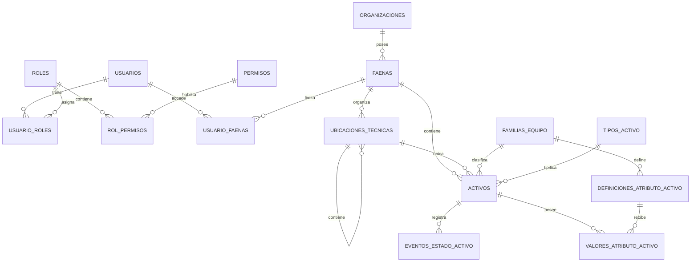
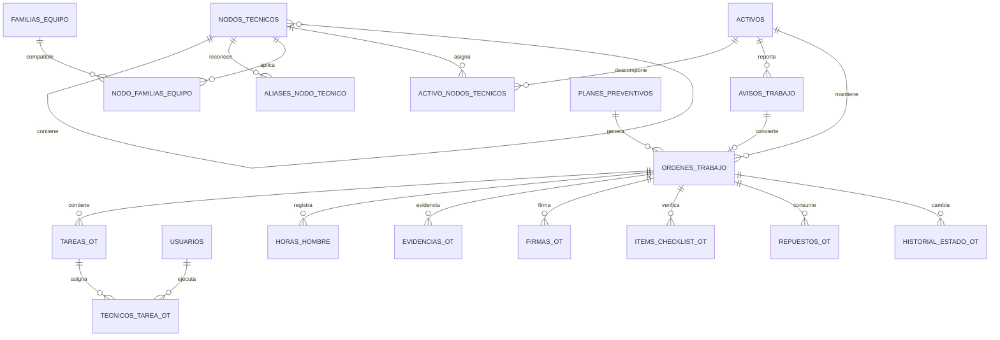
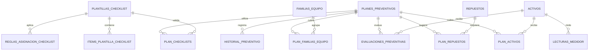
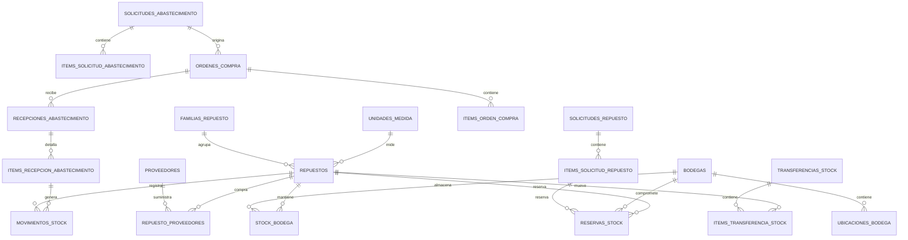
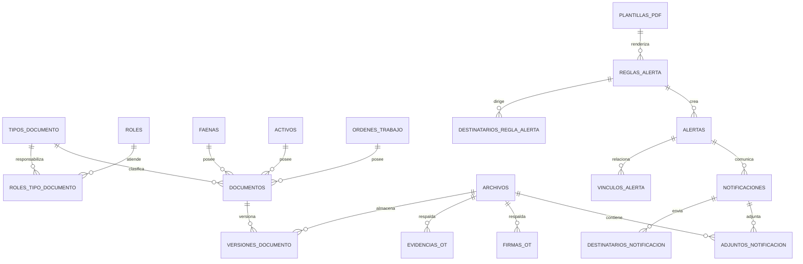
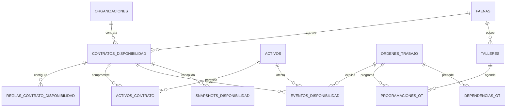

# Modelo relacional SQL del CMMS

## 1. Alcance

Se revisaron los **49 archivos Excel** incluidos en `excel.zip` y sus encabezados reales. Los Excel representan el almacenamiento provisional del sistema, pero **no deben convertirse uno a uno en 49 tablas**: varios contienen listas dentro de una celda, datos derivados, enlaces a archivos y entidades mezcladas en una misma fila.

La propuesta resultante contiene un modelo normalizado para PostgreSQL 16, dividido por dominios. El archivo `cmms_schema_postgresql.sql` incluye las columnas, claves primarias, claves foráneas, restricciones e índices principales.

> Decisión de diseño: usar UUID como clave primaria técnica y mantener los códigos operacionales (`Codigo`, `NumeroOT`, `NumeroSolicitud`, etc.) como claves de negocio únicas.

## 2. Correcciones necesarias respecto de los Excel actuales

1. **Familia de equipo debe ser un maestro cerrado.** `activos.Familia`, `planes_preventivos.FamiliaEquipo`, `checklists.FamiliaActivo` y `repuestos.FamiliaEquipo` deben referenciar `familias_equipo`. No se debería crear una familia libremente mientras se crea un activo.
2. `usuarios.Roles`, `usuarios.Faenas`, `roles.Permisos`, `alert_rules.Recipients` y `document_types.RolesResponsables` son listas; se reemplazan por tablas puente.
3. `checklists.Items`, `bodegas.UbicacionesInternas`, `planes_preventivos.RepuestosSugeridos`, `sistemas_componentes.FamiliasEquipo`, `ActivosAsignados` y `AliasHistoricos` también se separan en filas relacionadas.
4. `programacion_alertas.xlsx` no necesita una tabla independiente: se integra en `alertas` y `vinculos_alerta`, usando `origen = 'PROGRAMACION'`.
5. `stock_bodegas.StockDisponible` es derivado (`StockFisico - StockReservado`) y se calcula en la base; no debe editarse.
6. Las URL y rutas de documentos/evidencias no deben repetirse en cada módulo. Todos los archivos se registran en `archivos` y los módulos guardan su FK.
7. `documentos` se divide en **documento lógico** y **versiones**, evitando borrar el historial cuando un archivo se reemplaza.
8. `ordenes_compra`, transferencias, solicitudes y recepciones se dividen en cabecera e ítems para soportar varias líneas.
9. `FichaTecnicaJson` se reemplaza por definiciones y valores de atributos por familia. Para atributos extraordinarios, `valor` puede seguir siendo `JSONB`.
10. `audit_log.EntityName/EntityId` se conserva intencionalmente sin FK para mantener evidencia aunque la entidad original se archive o elimine lógicamente.

## 3. Dominios del modelo

| Dominio | Tablas principales |
|---|---|
| Seguridad y acceso | `usuarios`, `roles`, `permisos`, `usuario_roles`, `rol_permisos`, `usuario_faenas` |
| Organización | `organizaciones`, `faenas`, `ubicaciones_tecnicas` |
| Activos | `familias_equipo`, `tipos_activo`, `activos`, atributos de activo, historial de estado |
| Jerarquía técnica | `nodos_tecnicos`, alias, familias compatibles y asignación a activos |
| Archivos y documentos | `archivos`, `tipos_documento`, `documentos`, `versiones_documento` |
| Inventario maestro | `repuestos`, familias, unidades, proveedores, bodegas y ubicaciones internas |
| Preventivo y checklist | plantillas, ítems, reglas, planes, alcances, repuestos y lecturas |
| Mantenimiento | avisos, OT, tareas, técnicos, HH, evidencias, firmas, checklist y repuestos |
| Stock | stock por bodega, movimientos, reservas, solicitudes y transferencias |
| Abastecimiento | solicitudes, ítems, historial, OC, recepciones e ítems |
| Disponibilidad | contratos, reglas, activos, eventos y snapshots |
| Programación | talleres, programación de OT y dependencias |
| Alertas y auditoría | reglas, destinatarios, alertas, notificaciones y auditoría |

## 4. Mapeo completo desde Excel hacia SQL

| Excel actual | Tabla(s) SQL destino | Transformación |
|---|---|---|
| `abastecimiento_solicitudes.xlsx` | `solicitudes_abastecimiento, items_solicitud_abastecimiento, historial_solicitud_abastecimiento` | Separa cabecera, lineas y transiciones de estado; las URL de respaldo pasan a archivos. |
| `activos.xlsx` | `activos, familias_equipo, tipos_activo, definiciones_atributo_activo, valores_atributo_activo` | Familia y tipo se vuelven maestros. FichaTecnicaJson se migra a atributos definidos por familia. |
| `alert_rules.xlsx` | `reglas_alerta, destinatarios_regla_alerta` | Recipients deja de ser una lista en una celda. |
| `alerts.xlsx` | `alertas, vinculos_alerta` | La entidad afectada se registra mediante vinculos con FK. |
| `asset_state_events.xlsx` | `eventos_estado_activo` | Historial append-only de estados del activo. |
| `audit_log.xlsx` | `auditoria` | Before/After quedan como JSONB; EntityName/EntityId se mantienen sin FK por trazabilidad historica. |
| `avisos_trabajo.xlsx` | `avisos_trabajo` | Sistema/subsistema/componente se reemplazan por el nodo tecnico mas especifico. Evidencia inicial referencia archivos. |
| `bodegas.xlsx` | `bodegas, ubicaciones_bodega` | UbicacionesInternas se normaliza como jerarquia. |
| `checklists.xlsx` | `plantillas_checklist, items_plantilla_checklist, reglas_asignacion_checklist, plan_checklists` | Items y alcances dejan de guardarse como listas embebidas. |
| `disponibilidad_activos_contrato.xlsx` | `activos_contrato` | Tabla puente contrato-activo con rol y vigencia. |
| `disponibilidad_contratos.xlsx` | `contratos_disponibilidad, reglas_contrato_disponibilidad` | Cliente se relaciona con organizaciones; ReglasCliente se descompone por clave. |
| `disponibilidad_eventos.xlsx` | `eventos_disponibilidad` | Mantiene contrato, activo, periodo, causa y efecto en disponibilidad. |
| `disponibilidad_snapshots.xlsx` | `snapshots_disponibilidad` | Dato derivado historico y append-only para BI; no se edita manualmente. |
| `document_types.xlsx` | `tipos_documento, roles_tipo_documento` | RolesResponsables se convierte en relacion muchos-a-muchos. |
| `documentos.xlsx` | `documentos, versiones_documento, archivos` | Separa documento logico, versiones y binario externo. |
| `faenas.xlsx` | `faenas, organizaciones` | Empresa se normaliza cuando corresponda; coordenadas se convierten a numericas. |
| `notifications.xlsx` | `notificaciones, destinatarios_notificacion, adjuntos_notificacion` | Recipients y PDF se normalizan; el PDF real queda fuera de SQL. |
| `ordenes_compra.xlsx` | `ordenes_compra, items_orden_compra` | Separa cabecera de OC y lineas; documento OC referencia archivos. |
| `ordenes_trabajo.xlsx` | `ordenes_trabajo` | Referencia aviso, activo, faena, plan preventivo y nodo tecnico mediante FK. |
| `ot_checklists.xlsx` | `items_checklist_ot` | Instancias de checklist con snapshots de texto y referencias a evidencia/firma. |
| `ot_estado_historial.xlsx` | `historial_estado_ot` | Historial append-only de estados de OT. |
| `ot_evidencias.xlsx` | `evidencias_ot, archivos` | Solo metadata operacional en SQL; archivo fisico en SharePoint/blob storage. |
| `ot_firmas.xlsx` | `firmas_ot, archivos` | SignatureImageDataUrl se elimina; se guarda archivo, hash, autor y fecha. |
| `ot_hh.xlsx` | `horas_hombre` | Relaciona OT, tarea y tecnico con validacion de supervisor. |
| `ot_repuestos.xlsx` | `repuestos_ot` | Relaciona OT/tarea con repuesto y bodega. |
| `ot_tecnicos_tarea.xlsx` | `tecnicos_tarea_ot` | Tabla puente muchos-a-muchos entre tareas y tecnicos. |
| `pdf_templates.xlsx` | `plantillas_pdf` | HTML y asunto pueden permanecer en SQL por ser configuracion textual versionable. |
| `planes_preventivos.xlsx` | `planes_preventivos, plan_activos, plan_familias_equipo, plan_checklists, plan_repuestos` | Separa alcance, checklist y repuestos sugeridos. |
| `preventivo_evaluaciones.xlsx` | `evaluaciones_preventivas` | Resultado calculado por plan y activo, con OT generada opcional. |
| `preventivo_historial.xlsx` | `historial_preventivo` | Cambios y reprogramaciones append-only. |
| `preventivo_lecturas.xlsx` | `lecturas_medidor, archivos` | La evidencia se guarda fuera de SQL y se referencia por FK. |
| `programacion_alertas.xlsx` | `alertas, vinculos_alerta` | Se integra al motor general de alertas usando origen PROGRAMACION. |
| `programacion_dependencias.xlsx` | `dependencias_ot` | Relacion dirigida OT predecesora -> OT sucesora. |
| `programacion_ot.xlsx` | `programaciones_ot` | Programa OT por taller, tecnico y ventana temporal. |
| `programacion_talleres.xlsx` | `talleres` | Maestro de talleres y capacidades. |
| `proveedores.xlsx` | `proveedores` | Maestro normalizado; la relacion con repuestos va en repuesto_proveedores. |
| `recepciones_abastecimiento.xlsx` | `recepciones_abastecimiento, items_recepcion_abastecimiento` | Separa cabecera, lineas, archivos y movimientos de stock. |
| `repuestos.xlsx` | `repuestos, familias_repuesto, unidades_medida, repuesto_proveedores, repuesto_familias_equipo, repuesto_sustitutos` | Proveedor, compatibilidad y reemplazos dejan de ser campos simples. |
| `roles.xlsx` | `roles, permisos, rol_permisos` | Permisos deja de ser una lista separada por punto y coma. |
| `sharepoint_files.xlsx` | `archivos` | Conserva metadata, URI, version y checksum; no contiene el binario. |
| `sistemas_componentes.xlsx` | `nodos_tecnicos, aliases_nodo_tecnico, nodo_familias_equipo, activo_nodos_tecnicos` | Jerarquia autocontenida; familias, activos y alias se normalizan. |
| `solicitudes_repuestos.xlsx` | `solicitudes_repuesto, items_solicitud_repuesto, historial_solicitud_repuesto` | Separa cabecera, lineas y aprobaciones/cambios de estado. |
| `stock_bodegas.xlsx` | `stock_bodega` | PK compuesta bodega-repuesto; StockDisponible se calcula, no se escribe. |
| `stock_movements.xlsx` | `movimientos_stock` | Libro mayor de stock append-only con referencias a OT, reserva, transferencia o solicitud. |
| `stock_reservations.xlsx` | `reservas_stock` | Reserva vinculada a repuesto, bodega, OT/tarea y solicitud. |
| `stock_transfers.xlsx` | `transferencias_stock, items_transferencia_stock` | Separa cabecera de transferencia y lineas de repuestos. |
| `tareas_ot.xlsx` | `tareas_ot` | Clave unica por OT y codigo de tarea. |
| `ubicaciones_tecnicas.xlsx` | `ubicaciones_tecnicas` | Jerarquia por CodigoPadre usando FK autorreferente. |
| `usuarios.xlsx` | `usuarios, usuario_roles, usuario_faenas` | Roles y Faenas dejan de ser listas; PasswordHash permanece en SQL. |

## 5. Información que debe guardarse fuera de SQL

| Información | Ubicación recomendada | Qué se guarda en SQL | Razón |
|---|---|---|---|
| PDF, Word, Excel, imágenes y videos | SharePoint, Azure Blob, S3 u object storage equivalente | `file_key`, URI, nombre, MIME, tamaño, versión, checksum, autor y fechas | Evita inflar la base, facilita versionado, descarga y políticas de retención |
| Evidencias fotográficas antes/después | Object storage | Registro en `evidencias_ot` + FK a `archivos` | Son binarios y pueden crecer rápidamente |
| Firmas dibujadas | Imagen PNG/SVG en object storage | Firmante, fecha, alcance, hash y FK al archivo | `SignatureImageDataUrl` en SQL desperdicia espacio y dificulta auditoría |
| PDFs generados por alertas | Object storage | Notificación, estado de envío y FK al archivo | El PDF es reproducible pero debe conservarse como evidencia |
| Respaldos de importaciones Excel | Object storage de retención limitada | Metadata, resultado de importación y FK al archivo | Permite reproducir una carga sin convertir el Excel en fuente operativa |
| Backups de base de datos | Servicio de backup/almacenamiento cifrado | Solo catálogo de ejecuciones si se requiere | No deben convivir dentro de la misma base respaldada |
| Logs técnicos de aplicación y telemetría | Application Insights, CloudWatch, ELK/OpenSearch u otro servicio de logs | Solo auditoría funcional relevante en `auditoria` | Los logs de diagnóstico tienen alto volumen y otra política de retención |
| Secretos, API keys y cadenas de conexión | Secret manager / variables seguras | Nunca el secreto; como máximo identificador o versión | Reduce exposición y permite rotación |
| Archivos offline aún no sincronizados | Almacenamiento temporal del dispositivo | `offline_id` y estado de sincronización | Son temporales; tras sincronizar pasan al repositorio definitivo |

### Información que sí debe permanecer en SQL

- Hashes de contraseña, nunca contraseñas en texto plano.
- Metadata de archivos y documentos.
- HTML de plantillas pequeñas y configurables.
- Estados, fechas, responsables, validaciones y trazabilidad.
- `before_json` y `after_json` de auditoría.
- Snapshots de disponibilidad, porque representan resultados históricos ya publicados.
- Atributos técnicos pequeños y consultables; pueden usar `JSONB` solo cuando su estructura varíe por familia.

## 6. Reglas de integridad recomendadas

- Borrado físico restringido para activos, OT, documentos, movimientos y auditoría; utilizar estados `INACTIVO`, `ANULADO` o `REEMPLAZADO`.
- `movimientos_stock`, historiales, auditoría y snapshots deben ser **append-only**.
- Un documento debe pertenecer exactamente a una faena, un activo o una OT.
- Una versión documental nunca se sobrescribe; una nueva versión referencia a la anterior.
- Toda modificación de stock debe originar un movimiento.
- La disponibilidad y el stock disponible se calculan; no se editan manualmente.
- Las claves de negocio deben ser únicas: código de activo, faena, bodega, repuesto, plan, checklist, aviso y número de OT.
- Las coordenadas de faena deben migrarse desde texto a `numeric`, convirtiendo `Sin dato`, `-` y valores vacíos a `NULL`.
- Los estados y catálogos se deben validar mediante restricciones o tablas maestras; no aceptar texto libre desde la interfaz.

## 7. Orden de migración sugerido

1. Organizaciones, usuarios, roles, permisos y faenas.
2. Ubicaciones técnicas, familias, tipos de activo, activos y jerarquía técnica.
3. Metadata de archivos y tipos documentales.
4. Unidades, proveedores, repuestos, bodegas y ubicaciones internas.
5. Checklists y planes preventivos.
6. Avisos, OT, tareas y tablas operacionales asociadas.
7. Stock, reservas, solicitudes, transferencias y abastecimiento.
8. Contratos de disponibilidad y programación.
9. Alertas, notificaciones, snapshots y auditoría.
10. Validación de conteos, huérfanos, duplicados y conciliación de stock antes de cambiar la aplicación a SQL.

## 8. Modelo UML/ER por dominio

### 8.1 Seguridad, organización y activos

### 8.2 Jerarquía técnica, avisos y órdenes de trabajo

### 8.3 Preventivo y checklist

### 8.4 Inventario y abastecimiento

### 8.5 Documentos, archivos, alertas y notificaciones

### 8.6 Disponibilidad y programación

## 9. Decisiones pendientes antes de implementar

- Confirmar motor definitivo: el DDL entregado está listo para PostgreSQL; para SQL Server deben ajustarse tipos y funciones de UUID/JSON.
- Definir catálogos oficiales de estados, prioridades, criticidades, tipos de mantenimiento, causas de indisponibilidad y tipos de movimiento.
- Confirmar si una OT puede cambiar de faena o activo después de creada. La recomendación es impedirlo salvo flujo administrativo auditado.
- Definir política de retención de evidencias, importaciones y PDFs.
- Confirmar si un documento puede aplicar simultáneamente a más de una entidad. El modelo actual exige exactamente una.
- Definir si los costos requieren historial contable y tipo de cambio; el modelo inicial usa moneda ISO de tres caracteres.
