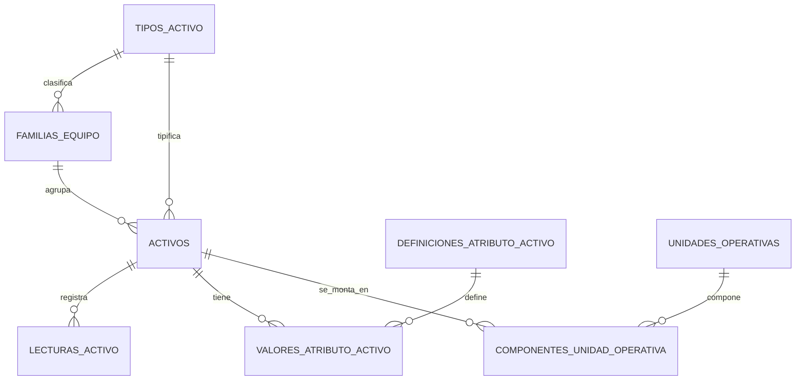

# Gestion documental y vencimientos

## Alcance

El modulo documental administra metadatos de documentos asociados a activos, OT y faenas. Los archivos viven en SharePoint o en el simulador local; el CMMS persiste referencia, estado, vencimiento, validacion, reemplazos y auditoria.

## Archivos Excel

- `document_types.xlsx`: catalogo configurable de tipos documentales.
- `documentos.xlsx`: registros documentales operativos e historicos.

`documentos.xlsx` no debe usarse para guardar binarios. Los campos `ArchivoKey` y `SharePointUrl` apuntan al archivo externo.

## Tipos documentales

Cada tipo documental define:

- `Codigo` y `Nombre`.
- `AplicaA`: `Activo`, `OT`, `Faena` o vacio para todos.
- `Obligatorio`, `Critico` y `BloqueaDisponibilidad`.
- `PlazoAlertaDias` para calcular documentos por vencer.
- `RolesResponsables`.
- `RequierePdfAlerta` y `PlantillaHtmlCodigo` para futuras alertas PDF/HTML.
- `Activo` para deshabilitar sin borrar.

Solo usuarios con `documentos.configurar` o administracion pueden crear o cambiar tipos.

## Estados

Estados soportados:

- `Vigente`
- `PorVencer`
- `Vencido`
- `PendienteCarga`
- `PendienteValidacion`
- `Rechazado`
- `Reemplazado`
- `Anulado`

El estado efectivo se recalcula al consultar:

- Sin archivo o link queda `PendienteCarga`.
- Con archivo y sin validar queda `PendienteValidacion`.
- Un documento validado vence si `FechaVencimiento` es menor que la fecha actual.
- Si vence dentro de `PlazoAlertaDias`, queda `PorVencer`.
- `Rechazado`, `Reemplazado` y `Anulado` se conservan como estados terminales.

## Reglas de gobierno

- No hay borrado fisico desde el CMMS.
- Reemplazar marca el documento anterior como `Reemplazado` y `EsHistorico=true`.
- Anular marca el documento como `Anulado` y `EsHistorico=true`.
- Validar bloquea la fecha de vencimiento mediante `FechaVencimientoValidada=true`.
- Cambiar una fecha validada requiere motivo y permiso `documentos.vencimiento_validado.modificar`.
- Rechazo, anulacion, reemplazo y validacion registran auditoria en el modulo `Documentos`.

## Disponibilidad

Un documento vencido bloquea disponibilidad si:

- No es historico.
- No esta anulado ni reemplazado.
- Esta vencido.
- Es critico o tiene `BloqueaDisponibilidad=true`.

Para activos, este bloqueo se refleja en la disponibilidad documental y en el endpoint de disponibilidad del activo.

## API

Endpoints principales:

- `GET /api/documents`
- `POST /api/documents`
- `GET /api/documents/{id}`
- `PUT /api/documents/{id}`
- `POST /api/documents/{id}/validate`
- `POST /api/documents/{id}/reject`
- `POST /api/documents/{id}/replace`
- `POST /api/documents/{id}/annul`
- `GET /api/documents/expired`
- `GET /api/documents/expiring`
- `GET /api/documents/matrix`
- `GET /api/documents/summary`
- `GET /api/documents/types`
- `POST /api/documents/types`
- `PUT /api/documents/types/{code}`

## Frontend

La pantalla `/documentos` incluye:

- Resumen de vigentes, por vencer, vencidos y bloqueantes.
- Listado filtrable por entidad, codigo, faena, tipo y estado.
- Matriz documental por faena.
- Vistas de vencidos y por vencer.
- Carga o actualizacion de metadatos con archivo/link SharePoint.
- Validacion, rechazo, reemplazo y anulacion.
- Configuracion de tipos documentales.

## Importacion

El importador acepta `document_types` y `documentos`. Para `documentos` valida:

- `TipoDocumento` contra `document_types` cuando exista catalogo.
- `EntidadTipo=Activo` contra `activos.Codigo`.
- `EntidadTipo=OT` contra `ordenes_trabajo.NumeroOT`.
- `EntidadTipo=Faena` contra `faenas.Codigo`.

## Modelo de activos normalizado

Los activos representan elementos físicos individuales. `tipos_activo` y `familias_equipo` se resuelven por FK; una familia pertenece a un tipo. La composición funcional se representa con `unidades_operativas` y el historial temporal de `componentes_unidad_operativa`, nunca como un tercer activo ni como nodo técnico.

Los datos variables se almacenan tipadamente en `definiciones_atributo_activo` y `valores_atributo_activo`. La medición de uso es única (`HOROMETRO`, `KILOMETRAJE` o nula) y las lecturas inmutables se registran en `lecturas_activo`. Los requisitos documentales se configuran por tipo/familia en `requisitos_documentales_tipo_activo`; el estado documental y la disponibilidad se calculan.

