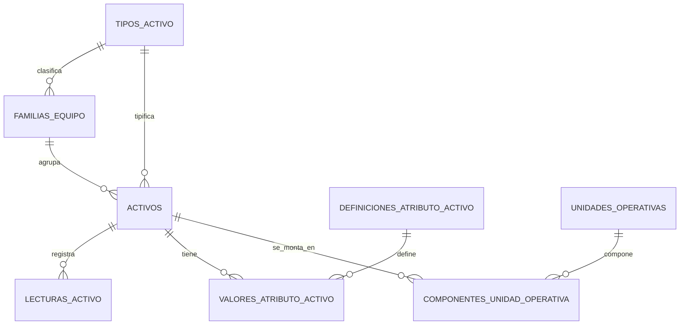

# Preventivos automaticos

El prompt 19 agrega el motor de preventivos en `/api/preventive` y la pagina `/preventivos`.

## Alcance

- Planes por activo especifico o por familia de equipo.
- Marca y modelo opcionales para acotar planes por familia.
- Frecuencia por horas, kilometros, calendario o combinada.
- Tolerancias por horas, kilometros y dias.
- Checklist asociado mediante `checklists.xlsx`.
- Repuestos sugeridos en formato `CODIGO:CANTIDAD:UNIDAD;CODIGO2:1:UN`.
- HH estimadas para crear la tarea base de la OT preventiva.
- Lecturas de horometro y kilometraje con fecha, usuario y evidencia opcional.
- Bloqueo de lecturas menores salvo correccion autorizada y auditada.
- Deteccion de saltos anomalos para revision.
- Estados: `Vigente`, `ProximoAVencer`, `EnVentana`, `Vencido`, `OTGenerada`, `Ejecutado`, `Reprogramado`.
- Generacion directa de OT preventiva usando `IWorkOrderService.CreatePreventiveAsync`.
- Notificaciones mediante `IAlertService` y reglas `preventive-created` / `preventive-overdue`.

## Hojas Excel

- `planes_preventivos.xlsx`: configuracion del plan, frecuencias, tolerancias, checklist, repuestos, HH y estado.
- `preventivo_lecturas.xlsx`: lecturas de horometro/km con validacion.
- `preventivo_evaluaciones.xlsx`: resultado historico de evaluaciones por plan y activo.
- `preventivo_historial.xlsx`: cambios de estado, reprogramaciones y OT generadas.
- `ordenes_trabajo.xlsx`: recibe `PlanPreventivoCodigo` y `EsPreventivaAutomatica`.

## Job programado

El host API registra Quartz con `PreventiveMaintenanceJob`.

Configuracion:

```json
"PreventiveMaintenance": {
  "JobsEnabled": true,
  "JobCron": "0 0/30 * * * ?"
}
```

El job invoca `IPreventiveMaintenanceService.RunAutomaticEvaluationAsync`, evalua vencimientos, crea OT cuando el plan esta en ventana o vencido y genera alertas. La logica queda en el servicio de aplicacion/infraestructura, no en Quartz, para mantener migracion SQL-ready.

## Migracion a SQL

La implementacion actual persiste con `IDataProvider`. Para SQL se deben mapear las cuatro hojas preventivas a tablas equivalentes y mantener los contratos `IPreventiveMaintenanceService`, modelos de aplicacion y endpoints sin cambios.

## Modelo de activos normalizado

Los activos representan elementos físicos individuales. `tipos_activo` y `familias_equipo` se resuelven por FK; una familia pertenece a un tipo. La composición funcional se representa con `unidades_operativas` y el historial temporal de `componentes_unidad_operativa`, nunca como un tercer activo ni como nodo técnico.

Los datos variables se almacenan tipadamente en `definiciones_atributo_activo` y `valores_atributo_activo`. La medición de uso es única (`HOROMETRO`, `KILOMETRAJE` o nula) y las lecturas inmutables se registran en `lecturas_activo`. Los requisitos documentales se configuran por tipo/familia en `requisitos_documentales_tipo_activo`; el estado documental y la disponibilidad se calculan.


