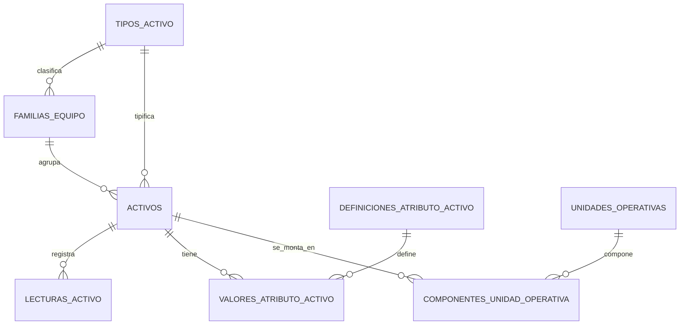

# Jerarquia tecnica

## Alcance

El modulo implementa la jerarquia:

`Faena -> Ubicacion tecnica -> Activo -> Sistema -> Subsistema -> Componente -> Subcomponente`

La fuente inicial es `data/excel/sistemas_componentes.xlsx`, pero la logica vive en `ITechnicalHierarchyService` sobre `IDataProvider`, preparada para migrar a SQL sin cambiar frontend ni endpoints.

## Backend

Endpoints principales:

- `GET /api/technical-hierarchy/nodes`
- `GET /api/technical-hierarchy/tree`
- `GET /api/technical-hierarchy/nodes/{code}`
- `POST /api/technical-hierarchy/nodes`
- `PUT /api/technical-hierarchy/nodes/{code}`
- `DELETE /api/technical-hierarchy/nodes/{code}`
- `POST /api/technical-hierarchy/nodes/{code}/obsolete`
- `GET /api/technical-hierarchy/duplicates`
- `POST /api/technical-hierarchy/merge`
- `POST /api/technical-hierarchy/families`
- `POST /api/technical-hierarchy/nodes/{code}/assets`

## Reglas

- Los maestros son cerrados: el codigo y nivel no se editan despues de creado el nodo.
- El borrado fisico no se usa; los nodos se marcan como obsoletos.
- Si un nodo tiene hijos o activos asignados, queda en uso y no desaparece del historico.
- Los nombres se normalizan quitando acentos, signos y espacios repetidos.
- Los duplicados similares se detectan por nombre normalizado, alias historicos y distancia de texto.
- La fusion requiere permiso `jerarquia.gestionar`, motivo y auditoria.
- Al fusionar, el nodo destino absorbe familias, activos, alias e hijos; el origen queda obsoleto y apunta a `FusionadoEnCodigo`.

## Excel

Columnas de `sistemas_componentes.xlsx`:

- `Codigo`
- `Nombre`
- `Nivel`
- `CodigoPadre`
- `NombreNormalizado`
- `FaenaCodigo`
- `UbicacionTecnicaCodigo`
- `FamiliasEquipo`
- `ActivosAsignados`
- `AliasHistoricos`
- `Obsoleto`
- `FusionadoEnCodigo`
- `FechaCreacionUtc`
- `FechaActualizacionUtc`

## Frontend

La ruta `/jerarquia-tecnica` incluye:

- Vista arbol.
- Vista tabla.
- Ficha del nodo.
- Seleccion multiple y asignacion masiva a familias.
- Asignacion a activos.
- Panel de duplicados similares y fusion autorizada.
- Filtros por faena, familia, sistema, nivel y obsoletos.

## Modelo de activos normalizado

Los activos representan elementos físicos individuales. `tipos_activo` y `familias_equipo` se resuelven por FK; una familia pertenece a un tipo. La composición funcional se representa con `unidades_operativas` y el historial temporal de `componentes_unidad_operativa`, nunca como un tercer activo ni como nodo técnico.

Los datos variables se almacenan tipadamente en `definiciones_atributo_activo` y `valores_atributo_activo`. La medición de uso es única (`HOROMETRO`, `KILOMETRAJE` o nula) y las lecturas inmutables se registran en `lecturas_activo`. Los requisitos documentales se configuran por tipo/familia en `requisitos_documentales_tipo_activo`; el estado documental y la disponibilidad se calculan.

